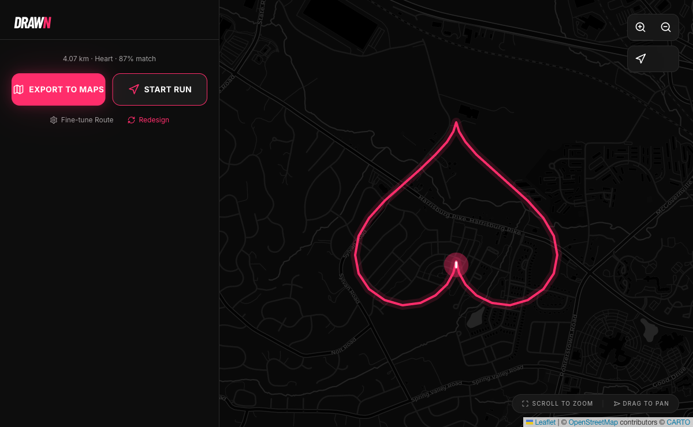
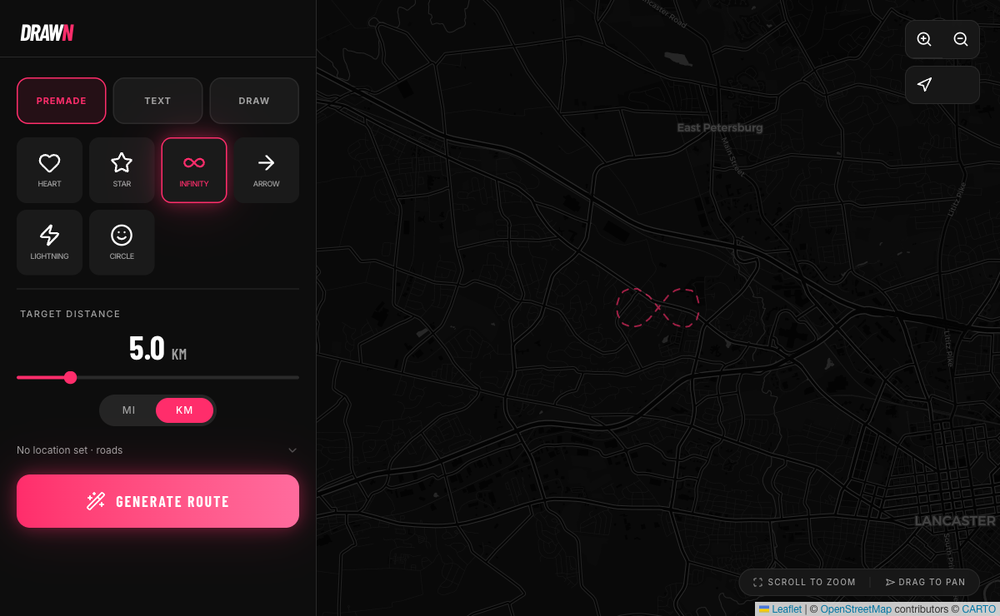
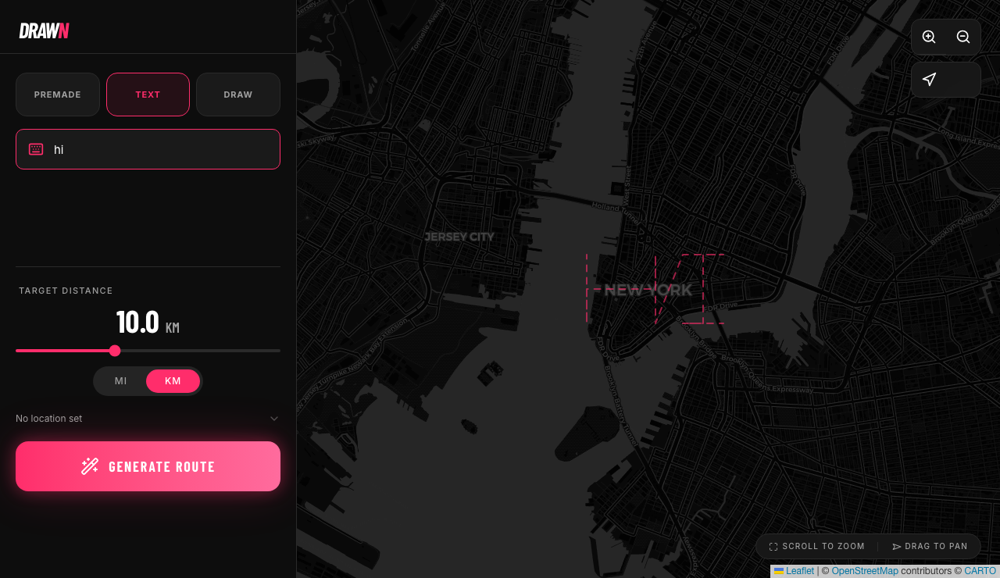
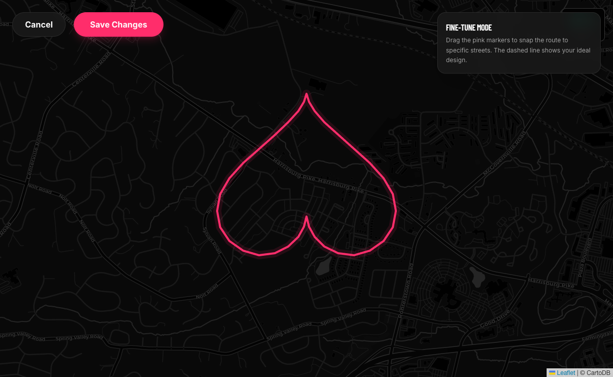
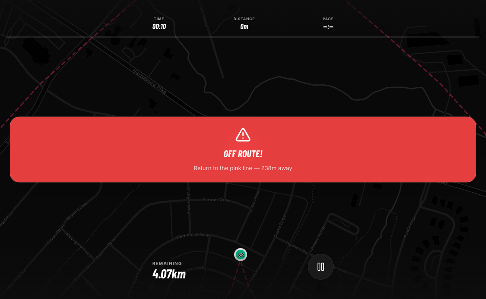

# Drawn

**Turn your next run into a work of art.**

Drawn lets you design GPS art routes — draw a shape, type a word, or pick a preset, and the app snaps it to real streets using AI-powered routing. The result is a runnable route that traces your design on a real map.



---

## Features

### Three Ways to Design

**Premade Shapes** — Pick from hearts, stars, circles, infinity loops, and more. Set your target distance and hit generate.



**Text Mode** — Type any word or name and run it. Three font styles: Stencil, Block, and Outline.



**Draw Mode** — Freehand draw your own shape directly on the map, then snap it to streets.

---

### AI-Powered Street Snapping

The generation pipeline works in five stages:

1. **Shape Math** — Generates the ideal coordinates for your design at the requested distance
2. **Road Network Fetch** — Pulls real streets from OpenStreetMap via the Overpass API
3. **Orientation Optimization** — Rotates and scales your shape to best fit the local road layout
4. **Gemini AI Anchor Selection** — Gemini 2.5 Flash analyzes the road network and picks the key corner nodes that preserve your shape
5. **OSRM Routing** — Routes between AI-selected anchors on real walkable streets

Every route is scored for shape fidelity. If the first attempt scores below 70%, the AI retries with corrected stage targets.

---

### Fine-Tune Mode

Drag individual waypoints to snap the route to specific streets after generation.



---

### Built-in Run Navigation

Start a run directly from the app. Your GPS position is tracked live on the map with turn-by-turn audio cues and off-route alerts.



---

### Export

Export your route as a GPX file or send it directly to Apple Maps or Google Maps for navigation.

---

## Tech Stack

| Layer | Technology |
|---|---|
| Frontend | React 19, TypeScript, Tailwind CSS 4 |
| AI | Google Gemini 2.5 Flash (`@google/genai`) |
| Maps | React-Leaflet, OpenStreetMap, CartoDB Dark tiles |
| Road Data | Overpass API |
| Routing | OSRM (public mirrors) + OpenRouteService fallback |
| Geometry | Turf.js |
| Auth & Storage | Firebase Authentication + Firestore |
| Animations | Motion (Framer Motion) |

---

## Getting Started

### Prerequisites

- Node.js v18+
- [Google AI Studio API key](https://aistudio.google.com/) (Gemini)
- [OpenRouteService API key](https://openrouteservice.org/) (optional routing fallback)

### Setup

```bash
git clone https://github.com/your-username/drawn.git
cd drawn
npm install
```

Create a `.env` file in the root:

```env
GEMINI_API_KEY=your_gemini_key_here
VITE_OPENROUTESERVICE_API_KEY=your_ors_key_here
```

```bash
npm run dev
```

Open [http://localhost:3000](http://localhost:3000).

### Available Commands

```bash
npm run dev       # Start dev server
npm run build     # Production build
npm run test      # Run tests (Vitest)
npm run lint      # TypeScript type check
```

---

## License

MIT
